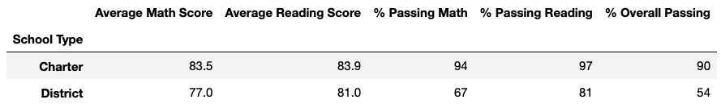

# School district analysis report
## 1. Overview

In this analysis  we are asked  to perform anew analysis not taking in account the math and reading scores of Thomas High School 9th graders. The reaon being that they think that it might be some dishinesty issues.
##2. Results
The results sections shows the comparison between each performed analysis, the images are labeled as "Module results" and "Challenge Results"
- How is district summary affected?!

As it is shown in Image 1 and 2, by replacing the math and reading scores of the ninth graders of THS, percentage of passing decreases, as the number of students remains te same, but the scores are NaN.

###### *Image 1. Module District Summary*
   

###### *Image 2. Challenge District Summary*
   

- How is the school school summary affected?

As shown in Image 4, After the scores are replaced by Nan, the challenge school summary shows that the percentage of passing students in THS decreases a lot because of the scores of the ninth graders. We need to adjust the correct percentage according to the remaining 10th, 11th and 12th grade in order to get the correct passing percentage shown in Image 5.

After removing the ninth graders, the module and challenge summary are very similar. as can be shown comparing THS values in Image 3 and 5.
###### *Image 3. Module School Summary*
   

###### *Image 4. Challenge School Summary*
   
   
###### *Image 5. Challenge School Summary adjusted*
   
   
- How does replacing the ninth grader's math and reading scores affect THS's performance relative to the other schools?

There are not changes in the performance relative to the other schools, since the second place is still hold by THS in both scenarios.
###### *Image 6. Module Top five schools*
   

###### *Image 7. Challenge Top five schools*
   

- How does replacing the ninth-grade scores affect the math and reading scores by grade?

The scores are very similar even when the ninth graders were removed, as it is shown in Images 8,9,10 and 11.
###### *Image 8. Module math scores*
   

###### *Image 9. Challenge math scores*
   

###### *Image 10. Module reading scores*
   

###### *Image 11. Challenge reading scores*
   
   
- How does replacing the ninth-grade scores affect the scores by school spending?
###### *Image 12. Module score by school spending*
   

###### *Image 13. Challenge score by school spending*
   
   
- How does replacing the ninth-grade scores affect the scores by school size?
###### *Image 12. Module score by school size*
   

###### *Image 13. Challenge score by school size*
   
   
- How does replacing the ninth-grade scores affect the scores by school type?
###### *Image 14. Module score by school type*
   

###### *Image 15. Challenge score by school type*
   

## 3. Summary
Even when the ninth graders of THS school were removed from the complete data frame, the values are very similar in all the analysis sections.
The main reason of this is probably because the distribution of scores are very close  considering the 9th, 10th, 11th and 12th graders. So, If a whole grade is removed, the average values remains very similar.
